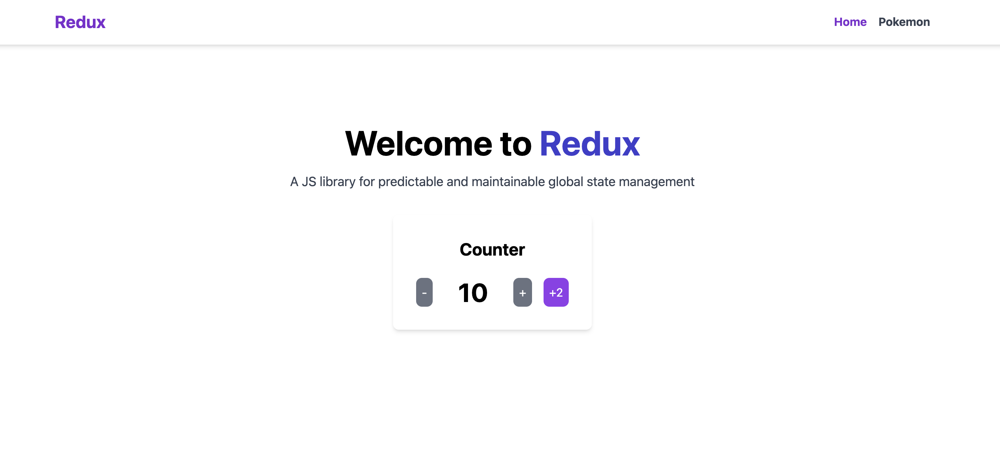

# Toolkit Redux


[Toolkit Redux Repository](https://github.com/RicardoTrejoSanjuan/toolkit-redux)



## Features

- Create, read, update, and delete products.
- User authentication for secure access to certain routes.
- Robust error handling for invalid data and request handling.

## Technologies

- **Frontend**: React, Vite, TypeScript
- **State Management**: Redux Toolkit
- **Middleware**: Redux Thunk for asynchronous actions
  
## Getting Started

1. Clone the repository:

   ```bash
   git clone https://github.com/RicardoTrejoSanjuan/toolkit-redux.git
   ```

2. Navigate to the project directory:

   ```bash
   cd product-manager-api
   ```

3. Install dependencies:

   ```bash
   npm install
   ```

4. Set up environment variables by creating a `.env` file in the root directory and adding the necessary configurations.

5. Start the development server:

   ```bash
   npm run dev
   ```

## Redux Concepts

### 1. **Redux Store**
   The global state for managing products and authentication is handled using Redux Store. This allows for consistent state management across components.

### 2. **Middlewares**
   Middlewares such as Redux Thunk are used to handle asynchronous operations (e.g., fetching products from the API).

### 3. **Dispatch**
   The `dispatch` function is used to trigger actions that update the state in response to user interactions or async operations.

### 4. **Actions**
   Actions represent the intention to change the state. The actions are dispatched from components to the Redux store.

### 5. **State**
   The state includes all the product data, user authentication info, and any UI-related state (like loading indicators).

### 6. **Asynchronous Actions**
   With Redux Thunk, asynchronous actions are handled, such as API requests for product data fetching, adding, and deleting.

### 7. **Redux Toolkit**
   Redux Toolkit simplifies the process of managing state with built-in functions for creating actions and reducers. This project leverages Redux Toolkit's `createSlice` to define the products slice.

### 8. **Slices**
   Slices represent individual parts of the Redux state. In this project, slices are created for products and user authentication.

## Learning Outcomes

In this project, I learned and applied the following Redux concepts:

- **Redux Store**: How to create and configure the store to manage global state.
- **Middleware**: The use of middleware like Redux Thunk for handling asynchronous logic.
- **Dispatching Actions**: Using dispatch to trigger state updates.
- **Managing State**: Properly structuring and managing global state with Redux.
- **Redux Toolkit**: How to efficiently manage slices of state using Redux Toolkit, reducing boilerplate code.
- **Handling Asynchronous Logic**: Using Redux Thunk for handling async requests like fetching product data from APIs.

## Usage

1. **Counter Example**:  
   Utilize Redux to manage a simple counter. You can increment, decrement, and reset the counter using dispatch actions. The state is managed globally through Redux, showcasing how to handle small-scale state management.

2. **Pokémon API Example**:  
   Fetch data from the Pokémon API and display a list of Pokémon. Redux is used to manage both the loading state and the fetched Pokémon data, demonstrating how to handle asynchronous API calls with Redux Toolkit and Redux Thunk.

## Contributing

If you'd like to contribute to this project, feel free to open a pull request or file an issue.

Contributions are welcome. If you wish to improve this project:

1. Fork the repository.
2. Create a new branch (`git checkout -b feature/new-feature`).
3. Make your changes and commit them (`git commit -m 'Add new feature'`).
4. Push the branch (`git push origin feature/new-feature`).
5. Open a pull request.

## License

This project is licensed under the [MIT License](LICENSE).